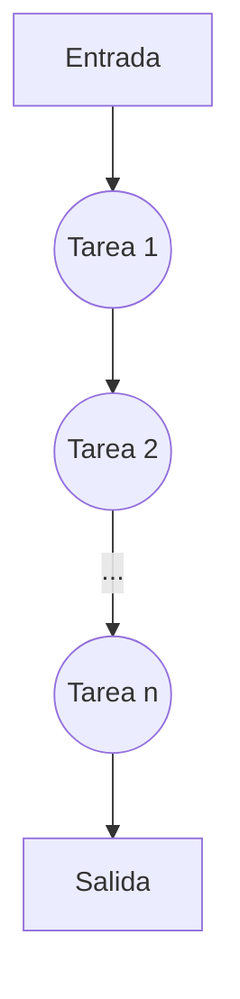
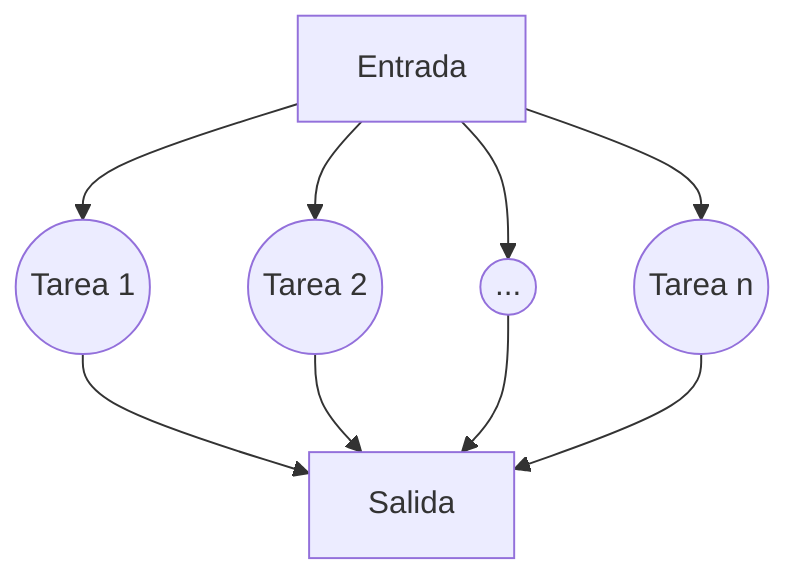

---
# Title, summary, and page position.
linktitle: Introducción
weight: 1
icon: memory
icon_pack: fas

# Page metadata.
title: ''
type: book  # Do not modify.
---

# Cómputo de alto rendimiento

## ¿Qué es el cómputo de alto rendimiento?

La computación de alto rendimiento (HPC en inglés) es la capacidad de procesar datos y realizar cálculos complejos a altas velocidades. Para ponerlo en perspectiva, una computadora portátil o de escritorio con un procesador de 3 GHz puede realizar alrededor de 3 mil millones de cálculos por segundo. Si bien eso es mucho más rápido de lo que cualquier ser humano puede lograr, las soluciones de HPC pueden realizar billones de cálculos por segundo.

Uno de los tipos más conocidos de soluciones HPC es la supercomputadora. Una supercomputadora contiene miles de nodos de cálculo que trabajan juntos para completar una o más tareas. A esto se le llama procesamiento paralelo. Es similar a tener miles de PC conectadas en red, combinando la potencia informática para completar las tareas más rápido.

## ¿Por qué es importante el HPC?
Los datos han permitido a los científicos realizar descubrimientos revolucionarios, que han permitido mejorar la calidad de vida de miles de millones de personas en todo el mundo. HPC es la base de los avances científicos, industriales y sociales.

A medida que evolucionan tecnologías como Internet de las cosas (IoT), la inteligencia artificial (IA) y las imágenes en 3-D, el tamaño y la cantidad de datos con los que las organizaciones tienen que trabajar crece exponencialmente. Para muchos propósitos, como la transmisión de un evento deportivo en vivo, el seguimiento de una tormenta en desarrollo, la prueba de nuevos productos o el análisis de las tendencias de las existencias, la capacidad de procesar datos en tiempo real es crucial.

Para mantenerse un paso por delante de la competencia, las organizaciones necesitan una infraestructura de TI altamente confiable y ultrarrápida para procesar, almacenar y analizar cantidades masivas de datos.

## ¿Cómo funciona HPC?
Existen dos métodos principales para procesar la información en HPC: 

### Procesamiento en serie
Es el que realizan las unidades de procesamiento central (CPU). Cada núcleo de CPU, por lo general, realiza solo una tarea a la vez. Las CPU son fundamentales para ejecutar diferentes funciones, como sistemas operativos y aplicaciones básicas (por ej., procesamiento de textos, productividad en la oficina).

### Procesamiento en paralelo
Es el que se puede realizar mediante varias CPU o unidades de procesamiento de gráficos (GPU). Las GPU, diseñadas originalmente para gráficos independientes, son capaces de realizar diferentes operaciones aritméticas por medio de una matriz de datos (como pixeles de pantalla) de forma simultánea. La capacidad para trabajar en varios planos de datos al mismo tiempo hace que las GPU sean la elección natural para el procesamiento en paralelo en tareas de aplicaciones de aprendizaje automático (AA), como el reconocimiento de objetos en videos.

Para construir una arquitectura informática de alto rendimiento, los servidores informáticos están conectados en red en un clúster. Los programas de software y los algoritmos se ejecutan simultáneamente en los servidores del clúster. El clúster está conectado en red al almacenamiento de datos para capturar la salida. Juntos, estos componentes funcionan a la perfección para completar un conjunto diverso de tareas.

Para operar al máximo rendimiento, cada componente debe seguir el ritmo de los demás. Por ejemplo, el componente de almacenamiento debe poder suministrar datos hacia y desde los servidores informáticos tan rápido como se procesan. Además, los componentes de la red deben poder soportar el transporte de datos a alta velocidad entre los servidores informáticos y el almacenamiento de datos. Si un componente no puede mantenerse al día con el resto, el rendimiento de toda la infraestructura de HPC sufre.

La potencia de procesamiento de las computadoras se mide en unidades llamadas “FLOPS” (operaciones de punto flotante por segundo). A principios de 2019, la supercomputadora más potente que existe alcanzó los 143,5 petaFLOPS (${143x10^{15}}$). Este tipo de supercomputadora se llama equipo de petaescala y puede realizar más de mil billones de FLOPS. Por su parte, una computadora de escritorio para juegos de alta gama es más de un millón de veces más lenta y llega apenas a los 200 gigaFLOPS (200x${10^{9}}$). Gracias a los avances tanto en procesamiento como rendimiento, pronto seremos testigos de un nuevo salto en la era de la supercomputación: la exaescala, que será casi 1000 veces más rápida que la petaescala. Esto significa que un sistema de exaescala podrá realizar ${10^{18}}$ (o mil millones por mil millones ) operaciones por segundo. [^1]

## ¿Qué es un clúster de HPC?
Un clúster de HPC consta de cientos o miles de servidores informáticos que están conectados en red. Cada servidor se llama nodo. Los nodos de cada clúster funcionan en paralelo entre sí, lo que aumenta la velocidad de procesamiento para ofrecer informática de alto rendimiento.



## ¿Cuándo debería utilizar un clúster HPC?

* Tu computadora no cuentas con suficientes recursos para ejecutar el modelo o el análisis que necesitas, ya que no cuentas con suficiente espacio de disco, memoria RAM, núcleos de procesamiento o ancho de banda en ru red doméstica.
* Necesitas ejectuar una tarea lo más rápido posible.
* Tu código necesiita ejecutar un conjunto grande de instrucciones.
* El software que necesitas ejecutar no es compatible con el hardware de tu computadora, tu sistema operativo, no cuentas con las licencias necesarias o tienes algún conflicto con los paquetes instalados.
* Tu código necesita mucho tiempo de ejecución.
* Necesitas paralelizarlo para bajar el tiempo de ejecución.

## ¿En qué se utiliza el cómputo de alto rendimiento?
* Aprendizaje automático: como subconjunto de la inteligencia artificial (IA), el aprendizaje automático (AA) se refiere a un sistema que tiene la capacidad de aprender de forma activa por sí mismo, a diferencia de recibir, de forma pasiva, instrucciones para ejecutar.
* Análisis de grandes conjuntos de datos: se recurre a la comparación rápida y a la correlación de grandes conjuntos de datos para complementar investigaciones y resolver problemas académicos, científicos, financieros, comerciales, gubernamentales, de salud y de seguridad cibernética. Este trabajo requiere un rendimiento masivo y capacidades de cómputo de una potencia enorme.
* Modelado avanzado y simulación: al no tener que realizar un montaje físico en las primeras etapas del proceso, el modelado avanzado y la simulación permiten que las empresas ahorren tiempo, materiales y costos de contratación de personal para lanzar sus productos al mercado con mayor rapidez.  El modelado y la simulación en HPC se aplican en el descubrimiento y la prueba de fármacos, diseños automotrices y aeroespaciales, pronóstico de sistemas climáticos o meteorológicos, y aplicaciones energéticas.



## Raspberry Pi

La Raspberry Pi es una serie de ordenadores de placa reducida, ordenadores de placa única u ordenadores de placa simple (SBC) de bajo costo desarrollado en el Reino Unido por la Raspberry Pi Foundation, con el objetivo de poner en manos de las personas de todo el mundo el poder de la informática y la creación digital.​

En este proyecto, hemos decido crear un clúster a partir de 4 Raspberry Pi 4. Tres de ellos actúan como nodos para realizar el cálculo real y uno actúa como maestro coordinándolos y proporcionando espacio en disco al resto. Nos referiremos a este sistema maestro como un "nodo de inicio de sesión" o "nodo principal".

Las carecterísticas del Raspberry Pi 4 son:
* Procesador: Quad-core Cortex-A72 (ARM v8) 64-bit SoC @ 1.5 GHz.
* Memoria RAM: 4 GB LPDDR4-2400 SDRAM.
* Cache: 32 KB data + 48 KB instruction L1 cache per core. 1MB L2 cache.
* Códecs: H.265 (4Kp60 decode); H.264 (1080p60 decode, 1080p30 encode); OpenGL ES, 3.0 graphics
* Puertos: PCIe bus, onboard Ethernet port, 2 × DSI ports (only one exposed on Raspberry Pi 4B), 2 × CSI ports (only one exposed on Raspberry Pi 4B), up to 6 × I2C, up to 6 × UART (muxed with I2C), up to 6 × SPI (only five exposed on Raspberry Pi 4B), dual HDMI video output, composite video output.

Para más detalles puedes consultar la [documentación oficial de Raspberry](https://www.raspberrypi.org/documentation/hardware/raspberrypi/bcm2711/README.md).



## ¿Por qué construir un clúster con Raspberry Pi?
* Es barato. Las placas Raspberry Pi 4 funcionan como nodos de cómputo y debido a su arquitectura, no es necesario tener una infraestructura especializada. Además, el costo de cada nodo es inferior al de uno tradicional.
* Es fácil de armar y configurar. Cuenta con documentación por parte de la comunidad.

[^1]: https://www.amd.com/en/campaigns/high-performance-computing